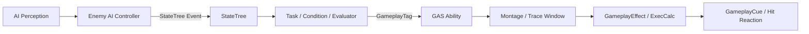
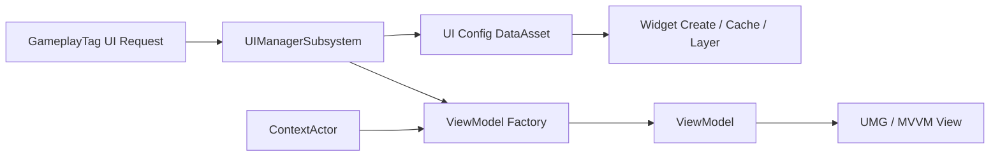

# EmptyCity

> Unreal Engine 5.5 팀 프로젝트에서 **Enemy AI·Combat**과 **UI 시스템**을 담당했습니다.

AI의 상태 판단부터 Gameplay Ability 실행, 전투 판정과 피드백까지 연결하고,
GameplayTag 기반 UI 관리와 MVVM 구조를 통해 게임플레이 데이터와 화면 로직을 분리했습니다.

<!-- MEDIA_TODO: 01-hero.gif | 전투, 패링, 맵, 인벤토리 UI를 15~20초 안에 보여주는 대표 GIF -->

## Contents

1. [Project Overview](#project-overview)
2. [Core Contributions](#core-contributions)
3. [Architecture](#architecture)
4. [Enemy AI & Combat](#1-enemy-ai--combat)
5. [UI Architecture](#2-ui-architecture)
6. [Event-driven Gameplay UI](#3-event-driven-gameplay-ui)
7. [Additional Implementations](#additional-implementations)
8. [Repository Scope](#repository-scope)

## Project Overview

| 항목 | 내용 |
|---|---|
| 프로젝트 형태 | Unreal Engine 5.5 기반 팀 프로젝트 |
| 담당 영역 | Enemy AI·Combat, UI |
| 언어 | C++, Blueprint |
| 주요 기술 | Gameplay Ability System, Gameplay Tags, StateTree, AI Perception, UMG, MVVM, Slate, Niagara |
| 저장소 범위 | 포트폴리오 검토를 위한 C++ 코드 및 구현 설명 |

## Core Contributions

| 영역 | 주요 구현 |
|---|---|
| Enemy AI & Combat | AI Perception과 StateTree를 연결하고, 재사용 가능한 Task·Condition·Evaluator를 통해 GAS 공격과 상태 처리를 구성 |
| UI Architecture | GameplayTag와 DataAsset 기반 위젯 생성, 레이어·포커스·닫기 순서·캐시 정책을 관리하는 UIManagerSubsystem 구현 |
| Gameplay UI | 월드 위치 기반 Indicator와 메시지 기반 Notification을 프로젝트 구조에 맞게 이식하고 게임플레이 시스템과 UI의 직접 의존성 분리 |

## Architecture





## 1. Enemy AI & Combat

### StateTree 기반 적 행동 구조

AI Controller는 감지 정보와 전투 대상을 관리하고, StateTree는 순찰·추적·공격과 상태 전환을 담당하도록 책임을 분리했습니다.
적 캐릭터가 보유한 StateTree 에셋을 빙의 시점에 적용하여 적 타입별 행동을 데이터로 구성하면서도 공통 실행 코드를 재사용할 수 있게 했습니다.

- AI Perception 감지 결과로 시야 여부, 마지막 확인 위치, 전투 대상을 갱신
- 최초 교전 시 GameplayTag 기반 StateTree Event 전송
- 공격 Ability의 활성 상태를 추적하여 StateTree Task의 완료 시점 결정
- 사거리, Ability 쿨다운, GameplayTag 상태를 재사용 가능한 Condition과 Evaluator로 분리
- State 진입과 이탈에 맞춰 GameplayEffect를 적용·제거하도록 Effect Handle 관리
- 플레이어와 멀어진 AI의 StateTree와 Tick을 일시 정지하는 거리 기반 LOD 구성

<!-- MEDIA_TODO: 02-statetree.png | 순찰 → 교전 → 추적 → 공격 → 상태이상 흐름이 보이는 StateTree 캡처 -->


관련 코드:

- [ECEnemyAIController.cpp](./EmptyCity/Character/Enemy/AI/ECEnemyAIController.cpp)
- [STTask_ActivateAbility.cpp](./EmptyCity/Character/Enemy/AI/Statetree/STTask/STTask_ActivateAbility.cpp)
- [STTask_ApplyGEWhileActive.cpp](./EmptyCity/Character/Enemy/AI/Statetree/STTask/STTask_ApplyGEWhileActive.cpp)
- [STEvaluator_TagStatus.cpp](./EmptyCity/Character/Enemy/AI/Statetree/STEvaluator/STEvaluator_TagStatus.cpp)
- [STCondition_CheckCooldown.cpp](./EmptyCity/Character/Enemy/AI/Statetree/STCondition/STCondition_CheckCooldown.cpp)

### GAS 기반 근접 전투 파이프라인

공격의 실행, 판정, 데미지 계산, 피격 반응을 하나의 클래스에 모으지 않고 Ability, Trace Component, GameplayEffect, GameplayCue로 분리했습니다.

```text
StateTree
→ Attack Ability 활성화
→ Montage NotifyState에서 Trace 구간 제어
→ HitResult를 GameplayEvent로 전달
→ 패링 가능 여부와 방향 판정
→ Damage GameplayEffect 적용
→ ExecCalc에서 가드/체력 피해 계산
→ GameplayCue에서 Hit Stop, VFX, SFX 실행
```

- 공격 구간에만 Trace를 활성화하고 한 공격에서 같은 대상을 중복 처리하지 않도록 관리
- 패링 가능 태그와 공격 방향의 내적을 이용해 전방 패링 여부 판정
- 공격별 설정에 따라 피격자에게 넉백 GameplayEvent 전달
- `SetByCaller`로 무기 공격력과 공격 배율을 전달하고 ExecCalc에서 최종 피해 계산
- 공격자·무기·공격 타입 GameplayTag 조합으로 Hit Stop, VFX, SFX 데이터 선택

<!-- MEDIA_TODO: 03-melee-trace.gif | 빠른 공격에서도 프레임 사이 궤적을 검사하는 Debug Sweep -->
<!-- MEDIA_TODO: 04-combat-feedback.gif | 패링, 넉백, Hit Stop과 VFX가 함께 보이는 전투 GIF -->

관련 코드:

- [ECEnemyDamageAbility_Melee.cpp](./EmptyCity/AbilitySystem/Ability/Enemy/ECEnemyDamageAbility_Melee.cpp)
- [EnemyMeleeTraceComponent.cpp](./EmptyCity/Character/Enemy/Component/EnemyMeleeTraceComponent.cpp)
- [WeaponTraceComponent.cpp](./EmptyCity/Equipment/Weapon/WeaponTraceComponent.cpp)
- [ECExecCalc_Damage.cpp](./EmptyCity/AbilitySystem/ExecCalc/ECExecCalc_Damage.cpp)
- [ECGameplayCue_CombatImpact.cpp](./EmptyCity/AbilitySystem/GameplayCue/ECGameplayCue_CombatImpact.cpp)

### Troubleshooting: 패링 반응과 행동 완료 시점 동기화

#### 문제

StateTree의 공격 Task는 공격 Ability가 활성 상태인 동안 `Running`을 유지하고, Ability가 종료되면 다음 행동으로 전환합니다.
패링 반응 몽타주가 공격 몽타주를 중단할 때 공격 Ability까지 즉시 종료하면, 패링 반응이 끝나기 전에 StateTree가 이동 상태로 전환하여 이동과 애니메이션이 겹쳤습니다.

반대로 공격 Ability를 그대로 유지하기만 하면 공격 Trace와 Weapon Trail이 남을 수 있었습니다.

#### 해결

공격 판정·연출의 정리 시점과 StateTree가 판단하는 논리적 공격 종료 시점을 분리했습니다.

1. 패링으로 공격 몽타주가 취소되면 Trace와 Trail은 즉시 종료합니다.
2. 공격 Ability는 바로 종료하지 않아 StateTree의 공격 Task를 `Running` 상태로 유지합니다.
3. 패링 반응 Ability가 몽타주 완료와 취소를 관리합니다.
4. 패링 반응이 종료된 시점에 실행 중인 공격 Ability를 정리하여 StateTree가 다음 행동으로 전환하게 합니다.

#### 결과

패링 반응 중 이동 상태로 전환되는 현상과 공격 판정·Trail이 남는 현상을 함께 방지했습니다.
이를 통해 서로 다른 상태 시스템을 연결할 때는 각 시스템의 완료 기준과 종료 책임을 일치시켜야 한다는 점을 확인했습니다.

<!-- MEDIA_TODO: 05-parry-lifecycle.gif | 공격 → 패링 → 반응 재생 → 반응 종료 후 행동 재개 흐름 -->

관련 코드:

- [ECEnemyDamageAbility_Melee.cpp](./EmptyCity/AbilitySystem/Ability/Enemy/ECEnemyDamageAbility_Melee.cpp)
- [ECGameplayAbility_Parried.cpp](./EmptyCity/AbilitySystem/Ability/Enemy/ECGameplayAbility_Parried.cpp)
- [STTask_ActivateAbility.cpp](./EmptyCity/Character/Enemy/AI/Statetree/STTask/STTask_ActivateAbility.cpp)

### 추가 피격에 따른 Stun 시간 연장

Stun Ability가 활성화되면 GameplayTag로 상태를 표현하고, Stun 중 추가 피격 이벤트를 받으면 타이머의 남은 시간에 연장 시간을 더하도록 구성했습니다.

- [ECGameplayAbility_Stun.cpp](./EmptyCity/AbilitySystem/Ability/Enemy/ECGameplayAbility_Stun.cpp)

## 2. UI Architecture

### GameplayTag 기반 UIManager

PlayerController가 특정 위젯 클래스를 직접 생성하지 않고 GameplayTag로 UI 열기·닫기를 요청하도록 구성했습니다.
UIManagerSubsystem은 DataAsset의 설정을 바탕으로 위젯의 생성, 레이어 배치, 캐싱, 포커스와 입력 모드를 관리합니다.

- GameplayTag를 위젯 요청의 공통 식별자로 사용
- HUD, 일반 Window, System UI를 MainLayout의 레이어로 분리
- 위젯별 캐시 정책에 따라 닫을 때 숨기거나 제거
- 활성 위젯 스택을 기준으로 Z-Order, 포커스, 마우스 커서와 입력 모드 갱신
- Fade가 필요한 UI는 전환 연출이 끝난 후 동일한 Toggle 경로 실행

관련 코드:

- [UIManagerSubsystem.cpp](./EmptyCity/UI/Subsystem/UIManagerSubsystem.cpp)
- [UIConfigDataAsset.h](./EmptyCity/Data/UI/UIConfigDataAsset.h)
- [ECMainLayoutWidget.cpp](./EmptyCity/UI/Widget/ECMainLayoutWidget.cpp)

### Root/Child 위젯의 닫기 순서

최상위 창은 UIManager의 전역 스택에서 관리하고, 상세정보와 같은 팝업은 부모 위젯의 자식 스택에서 관리합니다.
ESC 입력이 들어오면 가장 최근에 활성화된 자식부터 처리하고, 더 이상 자식이 없을 때 부모 창을 닫도록 구성했습니다.

<!-- MEDIA_TODO: 06-ui-close-stack.gif | 상세 팝업 → 부모 창 순서로 닫히는 ESC 처리 -->

관련 코드:

- [ECUserWidget.cpp](./EmptyCity/UI/Widget/ECUserWidget.cpp)
- [UIManagerSubsystem.cpp](./EmptyCity/UI/Subsystem/UIManagerSubsystem.cpp)

### ContextActor 기반 ViewModel 생성과 주입

위젯이 Subsystem이나 Actor를 직접 탐색하며 데이터를 가져오지 않도록 ViewModel 생성 경로를 공통화했습니다.

```text
UIManager가 위젯 생성
→ UI 설정에 등록된 ViewModel 생성
→ ContextActor를 기반으로 데이터 소스와 Delegate 연결
→ 위젯의 MVVM View에 ViewModel 주입
→ 초기값 Broadcast
```

- ViewModel의 Outer를 소유 위젯으로 지정하여 생명주기를 위젯에 귀속
- `ContextActor`를 통해 보관함, 침대 등 상호작용 대상에 맞는 데이터 연결
- 지속적으로 표시할 상태는 ViewModel FieldNotify로 노출
- Inventory 변경 Delegate를 ViewModel이 수신하고 UI 갱신 이벤트로 변환
- Widget 소멸 시 Delegate를 해제하여 남은 참조 방지

관련 코드:

- [ECViewModelFactoryLibrary.cpp](./EmptyCity/UI/ViewModel/ECViewModelFactoryLibrary.cpp)
- [ECViewModelBase.h](./EmptyCity/UI/ViewModel/ECViewModelBase.h)
- [InventoryViewModel.cpp](./EmptyCity/UI/ViewModel/InventoryViewModel.cpp)
- [InventoryInteractionViewModel.cpp](./EmptyCity/UI/ViewModel/InventoryInteractionViewModel.cpp)
- [TimeViewModel.cpp](./EmptyCity/UI/ViewModel/TimeViewModel.cpp)

## 3. Event-driven Gameplay UI

### Object Indicator

플레이어 입력으로 열고 닫는 일반 UI와 달리, 상호작용 대상의 월드 위치를 기준으로 표시되는 UI가 필요했습니다.
Lyra의 Indicator System을 분석하여 프로젝트에 필요한 구조를 이식하고, 표시 대상과 위젯 정보를 Descriptor로 전달하도록 구성했습니다.

IndicatorManagerComponent가 Indicator의 생성과 제거를 담당하기 때문에 상호작용 Ability는 실제 위젯 클래스를 직접 참조하지 않습니다.


관련 코드:

- [ECGameplayAbility_Interact.cpp](./EmptyCity/AbilitySystem/Ability/ECGameplayAbility_Interact.cpp)
- [ECIndicatorManagerComponent.cpp](./EmptyCity/UI/IndicatorSystem/ECIndicatorManagerComponent.cpp)
- [IndicatorDescriptor.cpp](./EmptyCity/UI/IndicatorSystem/IndicatorDescriptor.cpp)

### Gameplay Message 기반 Notification

아이템 획득, 지역 이동, 시간대 변경처럼 서로 다른 시스템에서 발생하는 이벤트를 같은 방식으로 UI에 표시하기 위해 메시지 기반 알림 구조를 구성했습니다.

Lyra의 Gameplay Message 구조를 프로젝트 범위에 맞게 단순화하여, 송신자는 GameplayTag 채널과 메시지 데이터만 전달하고 Notification Host Widget이 실제 알림 위젯을 생성하도록 분리했습니다.

```text
Gameplay System
→ GameplayTag Channel + Message Payload
→ GameplayMessageSubsystem
→ Notification Host Widget
→ Notification Widget 생성
```


관련 코드:

- [ECGameplayMessageSubsystem.cpp](./EmptyCity/Subsystem/ECGameplayMessageSubsystem.cpp)
- [ECNotificationHostWidget.cpp](./EmptyCity/UI/Widget/Notification/ECNotificationHostWidget.cpp)
- [ECMessageTypes.h](./EmptyCity/Subsystem/ECMessageTypes.h)

### Progression과 해금 상태

콘텐츠의 상태를 잠김, 해금, 새로 해금됐지만 아직 연출을 확인하지 않은 상태로 구분했습니다.
이를 통해 해금 여부와 최초 확인 연출 여부를 별도로 관리할 수 있게 했습니다.


- [ECProgressionSubsystem.cpp](./EmptyCity/Subsystem/ECProgressionSubsystem.cpp)

## Additional Implementations

### Inventory UI와 보관함 상호작용

Lyra 기반 Item Definition·Instance·Fragment 구조의 UI 정보를 슬롯과 상세정보 위젯에 표시했습니다.
또한 플레이어 인벤토리와 보관함 사이의 개별 이동, 전체 이동, 버리기 동작을 ViewModel을 통해 호출하고 변경 이벤트에 따라 양쪽 UI를 갱신하도록 구성했습니다.


관련 코드:

- [ECInventoryManagerComponent.cpp](./EmptyCity/Inventory/ECInventoryManagerComponent.cpp)
- [ECPlayerInventoryWidget.cpp](./EmptyCity/UI/Widget/Inventory/Player/ECPlayerInventoryWidget.cpp)
- [ECInventorySlotWidget.cpp](./EmptyCity/UI/Widget/Inventory/ECInventorySlotWidget.cpp)
- [InventoryInteractionViewModel.cpp](./EmptyCity/UI/ViewModel/InventoryInteractionViewModel.cpp)

### 마우스 위치 기준 Map 확대·축소

마우스 위치를 기준으로 확대·축소되도록 Scale 변화 비율에 따라 Translation을 보정했습니다.
또한 맵 위젯이 포커스를 가진 상태에서 방향키 입력을 받으면 미리 정의된 연결 관계에 따라 다음 지역 노드로 포커스를 이동합니다.


관련 코드:

- [ECPannableMapWidget.cpp](./EmptyCity/UI/Widget/Map/ECPannableMapWidget.cpp)
- [ECMapWidget.cpp](./EmptyCity/UI/Widget/Map/ECMapWidget.cpp)
- [ECMapNodeWidget.cpp](./EmptyCity/UI/Widget/Map/ECMapNodeWidget.cpp)

## Repository Scope

- 이 저장소는 실제 팀 프로젝트 전체가 아닌 **포트폴리오 검토용 C++ 코드 스냅샷**입니다.
- 게임 실행에 필요한 맵, Blueprint, 애니메이션, 사운드 및 Marketplace 에셋은 포함하지 않아 이 저장소만으로는 프로젝트를 실행할 수 없습니다.
- Lyra 구조를 참고한 Indicator, Gameplay Message, Inventory 영역은 원본 구조를 그대로 본인 설계로 주장하지 않고, 프로젝트 요구에 맞게 분석·이식·연동한 범위를 설명합니다.
- README의 구현 설명은 담당한 Enemy와 UI 영역을 중심으로 작성했습니다.
